\newpage
# **Semaines 6 & 7**

## **Que signifie “64-bit” dans “Debian 64-bit” ?**

- Un processeur 64 bits est un processeur dont **la largeur des registres est de 64 bits** sur les nombres entiers. Un processeur 64 bits **poura traiter plus d'information en même temps** qu'un processeur 32 bits. Dans notre cas **Debian 64-bit** signifie donc que cette version est compatible uniquement avec cette architecture.

Voir également :


- [32 ou 64 bits ? Comment savoir](https://lecrabeinfo.net/32-ou-64-bits-comment-savoir.html#32-bits-vs-64-bits-quelles-differences)
- [Windows 32 et 64 bits : Forum Aux Questions](https://support.microsoft.com/fr-fr/windows/windows-32-et-64-bits-forum-aux-questions-c6ca9541-8dce-4d48-0415-94a3faa2e13d)

## **Quelle est la configuration réseau utilisée par défaut ?**

- La configuration réseaux par défaut est une interface de type **Intel PRO/1000 MT Desktop (NAT)**, il s'agit d'un modèle de d'interface réseau de la marque Intel réputé.
- L'adresse MAC de notre machine est **08:00:27:e2:f5:a8**, nous l'avons récupéré dans les paramètres de VirtualBox *(voir Figure 1)* ou en utilisant la commande `ip link show` *(voir Figure 2)*.

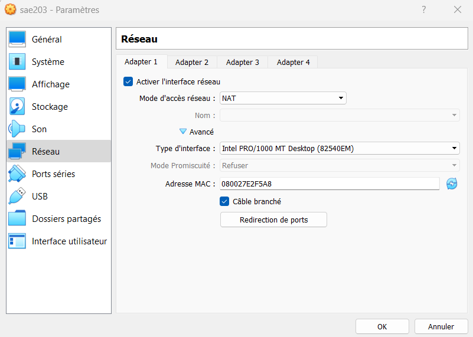{#id .class width=380 length=300}

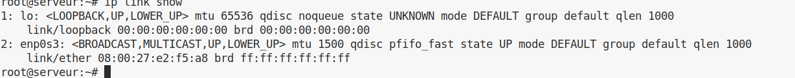{#id .class width=380 length=300}

## **Quel est le nom du fichier XML contenant la configuration de votre machine ?**
- Le fichier XML est en réalité le fichier `sae203.vbox`, avec une extension de fichier différente. Lorsque l'on ouvre celui-ci avec un éditeur de texte tel que [**Codium**](https://vscodium.com/), on remarque rapidement la syntaxe XML.

- XML est un métalangage informatique de balisage générique, sa syntaxe est dite « extensible » car elle permet de définir différents langages avec pour chacun son vocabulaire et sa grammaire, comme XHTML, XSLT, RSS, SVG… Elle est reconnaissable par son usage des chevrons (<, >) encadrant les noms des balises. 

Voir également :

- [Extensible Markup Language](https://developer.mozilla.org/fr/docs/Web/XML/XML_introduction)

## **Sauriez-vous le modifier directement ce fichier pour mettre 2 processeurs à votre machine ? Faites-le.**

- On utilise l'éditeur de texte de notre choix (ici `nano`)

```bash
nano sae203.vobx
```

- On modifie la **balise `<CPU>` on ajoute `count = 2`**, qui aura pour effet de modifier le nombre de coeurs de notre machine.

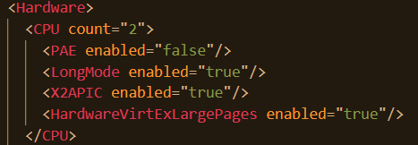{#id .class width=380 length=300 }  

- CPU est un acronyme anglais pour Central Proccessing Unit. Le CPU désigne un processeur ou microprocesseur principal d'un ordinateur, on parle aussi d'unité de traitement.

- Tandis qu'un coeur (en anglais, core) est un ensemble de circuits capables d'exécuter des programmes de façon autonome. Toutes les fonctionnalités nécessaires à l'exécution d'un programme sont présentes dans ces cœurs : compteur ordinal, registres, unités de calcul, etc.

- Ainsi au plus notre machine en disposera, au plus elle saura effectuer de calculs/opérations simultanément.
  
## **Qu’est-ce qu’un fichier iso bootable ?**

- Un fichier ISO est, en termes simples, un format de fichier numérique reproduisant un CD ou un DVD. L'extension de fichier ISO ne se contente pas de stocker des fichiers et des dossiers : elle contient toutes les informations vitales du système de fichiers concernant la structure du disque.
- On dit d'un disque qu'il est « bootable » lorsqu'il contient les composants logiciels nécessaires pour être **démarré directement au chargement de l'ordinateur**, avant le chargement du système d'exploitation installé sur la machine.

Voir également :

- [Bootable : qu'est-ce que c'est ?](https://www.futura-sciences.com/tech/definitions/informatique-bootable-18095/)
- [Image disque (ISO)](https://fr.wikipedia.org/wiki/Image_disque)
  

## **Qu’est-ce que MATE ? GNOME ?**
  
- MATE est un fork de GNOME 2. Il fournit un **environnement de bureau** (apparence de l'ordinateur) attractif et intuitif en se basant sur les métaphores traditionnelles pour GNU/Linux et d'autres systèmes d'exploitation similaires à Unix.

- On précise qu'un fork signifie qu'un logiciel créé à partir du code source d'un autre.

Voir également :

- [Qu'est-ce MATE ?](https://mate-desktop.org/fr/)
- [Qu'est-ce que GNOME](https://www.gnome.org/)
- [Qu'est-ce qu'un environnement de bureau ?](https://fr.wikipedia.org/wiki/Environnement_de_bureau)
  

## **Qu’est-ce qu’un serveur web ?**

- Un serveur web est un ordinateur qui **stocke, traite et livre des fichiers de sites web**. Il se compose d’un **côté matériel et d’un côté logiciel**, chacun jouant un rôle distinct dans le traitement des fichiers.

Voir également :

- [Qu'est-ce qu'un serveur web ?](https://developer.mozilla.org/fr/docs/Learn/Common_questions/What_is_a_web_server)

## **Qu’est-ce qu’un serveur ssh ?**

- SSH *(acronyme de Secure SHell)* est un protocole réseau qui permet aux administrateurs **d'accéder à distance à un ordinateur**, en toute sécurité. SSH désigne également l'ensemble des utilitaires qui mettent en oeuvre le protocole.

Voir également :

- [Qu'est-ce qu'un serveur ssh ?](https://doc.ubuntu-fr.org/ssh)

## **Qu’est-ce qu’un serveur mandataire ?**

- Un serveur mandataire ou proxy (de l'anglais) est un serveur informatique qui a pour fonction de **relayer des requêtes entre un poste client et un serveur**. Les serveurs mandataires sont notamment utilisés pour assurer les fonctions suivantes :

- mémoire cache
- la journalisation des requêtes ("logging")
- la sécurité du réseau local
- le filtrage et l'anonymat.

L'utilité des serveurs mandataires est importante, notamment dans le cadre de la sécurisation des systèmes d'information.

Voir également les différentes définitions d'un serveur mandataire :

- [Définition 1 *(techno-science)*](https://www.techno-science.net/definition/3812.html)
- [Définition 2 *(futura-science)*](https://www.futura-sciences.com/tech/definitions/internet-proxy-488/)
  

## **Comment peut-on savoir à quels groupes appartient l'utilisateur “user” ?**

- Nous pouvons visualiser les groupes auxquels appartient un utilisateur en lisant le fichier suivant à la ligne de l'utilisateur *"user"*:

```bash
cat /etc/group | grep user 
```

- Ou en utilisant directement la commande `groups`

```bash
groups user
```

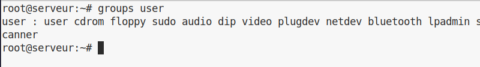{#id .class width=380 length=300}

Voir également :

- [Comment focntionnent les groupes linux ?](https://www.w3resource.com/linux-system-administration/groups.php)

## **Quel est la version du noyau Linux utilisé par votre VM ?**

- IL est avant tout important de bien saisir ce qu'est un noyau, dit Kernel. Il constitue le cœur du système qui exploite un ordinateur. Il établit la communication entre la partie matérielle et la partie logicielle de l'appareil. C'est ce qui permet à l'utilisateur d'interagir avec la machine.

- Ainsi pour en connaître la version il suffit d’utiliser la commande [`uname`](https://debian-facile.org/doc:systeme:uname), on a ainsi le numéro de version : "`5.10.0-21-amd64`"

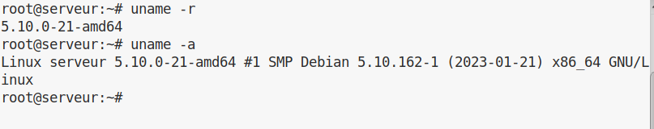{#id .class width=380 length=300}

- La première partie avant le `-` nous indiquant le numéro de version `5.10.0-21`, et la seconde notre architecture `amd64`.

Voir également :

- [Comment voir la version du noyau linux ?](https://www.malekal.com/comment-connaitre-la-version-du-noyau-linux/)

## **À quoi servent les suppléments invités ? Donner 2 principales raisons de les installer.**

- Après avoir [crée une machine virtuelle et installer l’OS sur Virtualbox](https://www.malekal.com/virtualbox-comment-creer-une-machine-virtuelle/), il convient d’installer les Virtualbox VirtualBox additions invités. (Guest Additions). 
  
- Cela permet **d’améliorer les performances et intégrations entre la machine hôte et la machine invité** mais aussi apporter de nouvelles fonctionnalités.

- Par exemple, vous pouvez [activer le copier/coller entre la machine hôte et invité](https://www.malekal.com/virtualbox-copier-coller-entre-la-vm-invite-et-machine-hote/), ou encore profiter d'une résolution d'écran adaptative/automatique.

Voir également :

- [Que sont les suppléments invités ?](https://lecrabeinfo.net/virtualbox-installer-les-additions-invite-guest-additions.html)  

## **À quoi sert la commande mount (dans notre cas de figure et dans le cas général) ?**

- La commande `mount` permet de **demander au système d'exploitation de rendre un système de fichiers accessible**, à un emplacement spécifié (le point de montage).

Voir également :

- [Qu'est ce que le mount ?](https://fr.theastrologypage.com/mount) 
  
\newpage

## **Compte rendu de l'installation machine virtuel**


### **Création de la machine virtuelle**

- Condition préalable : extension pack (VBoxGuestAddition.iso) présent sur la machine hôte 
- Création de la machine :
   - Nom de la machine dans VirtualBox : sae203
   - Dossier de la machine : `/usr/local/virtual_machine/infoetu/login` avec notre login personnel. 
   - Type : Linux
   - Version : Debian ou Debian 11 en [64-bit](#Que-signifie-“64-bit”-dans-“Debian-64-bit”-?)  

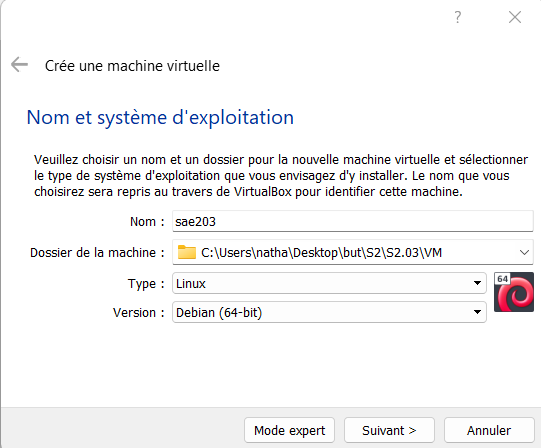{#id .class width=380 length=300}  

- Initialisation de la mémoire vive à 2048 Mo  

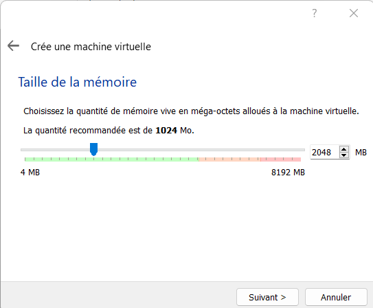{#id .class width=380 length=300}  

- 20 Go de disque dur sur une seule partition  

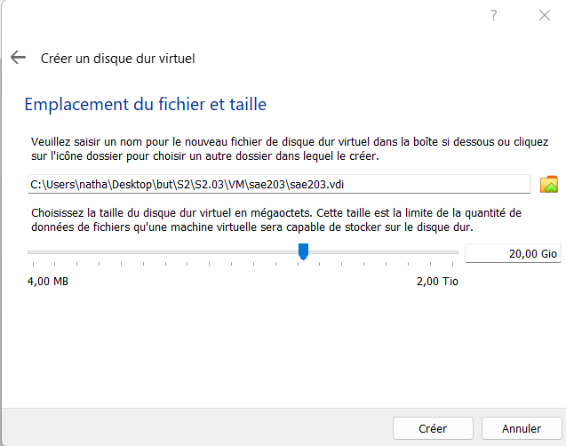{#id .class width=380 length=300}  

### **Installation du systeme d'exploitation Debian 11**

- Insérer le fichier [iso bootable](#Qu’est-ce-qu’un-fichier-iso-bootable-?) pour l'installation dans le lecteur cd de la machine

- Pays/langue : France

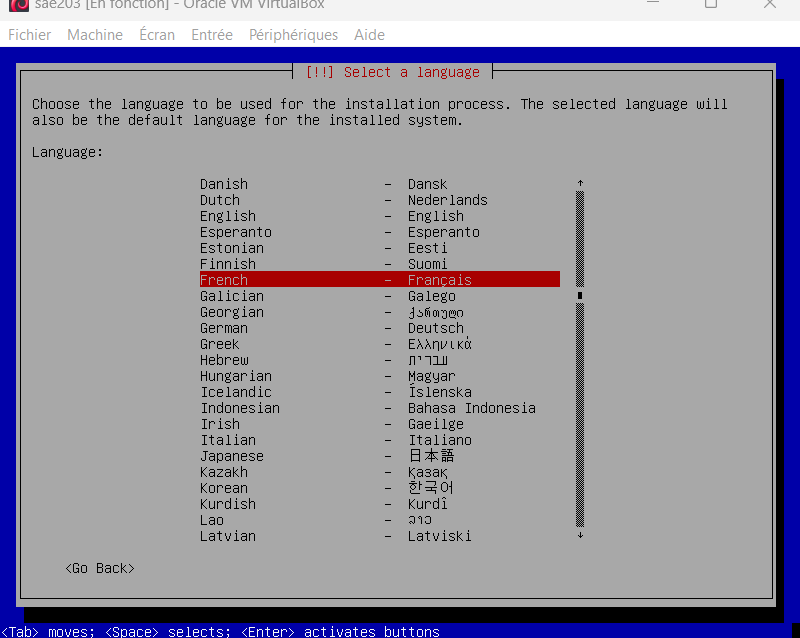{#id .class width=380 length=300}

- Nom de la machine : `serveur` 

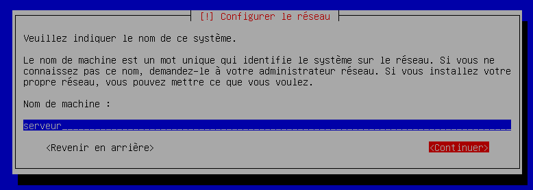{#id .class width=380 length=300}

- Compte administrateur : `root:root`

- Un Compte utilisateur : `User:user`

- Partition : 1 seule partition recouvrant le disque entier suffit 

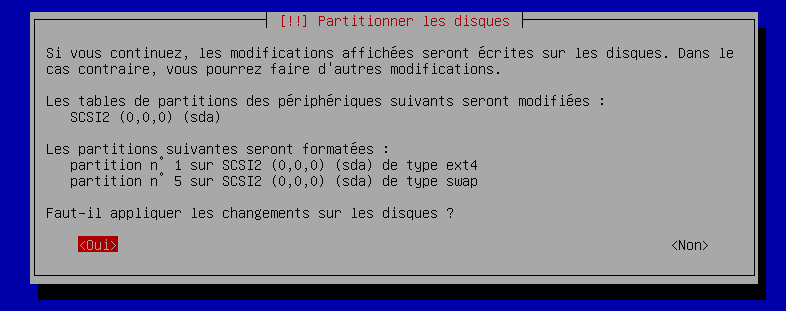{#id .class width=380 length=300}

- Miroir : http://debian.polytech-lille.fr
  - Les miroirs sont des serveurs, répartis dans le monde, qui répliquent l'information des serveurs Debian originaux et permettent de répartir la charge et de raccourcir le temps d'accès à l'information. Il existe, une vingtaine de miroirs en France.

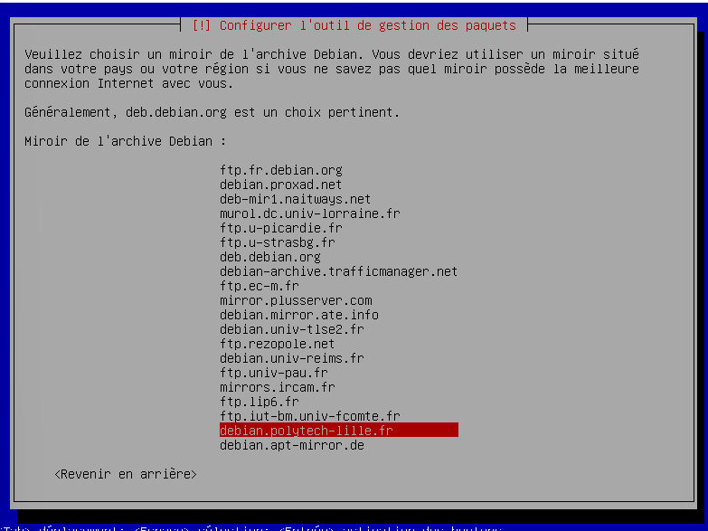{#id .class width=380 length=300}

- [Proxy](#Qu’est-ce-qu’un-serveur-mandataire-?) : http://cache.univ-lille.fr:3128 

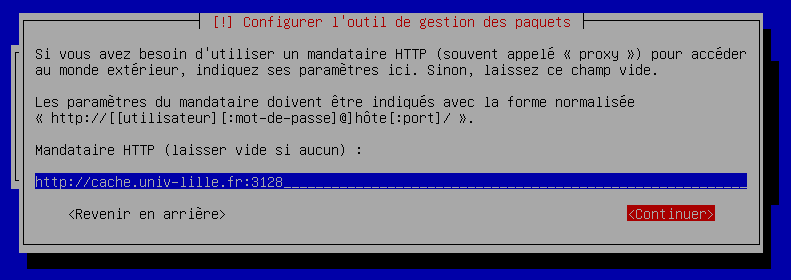{#id .class width=380 length=300}

- Sélection des logiciels de démarrage :  
  -  environnement de bureau Debian
  -  MATE
  -  serveur web
  -  serveur ssh  
  -  utilitaire usuels du système

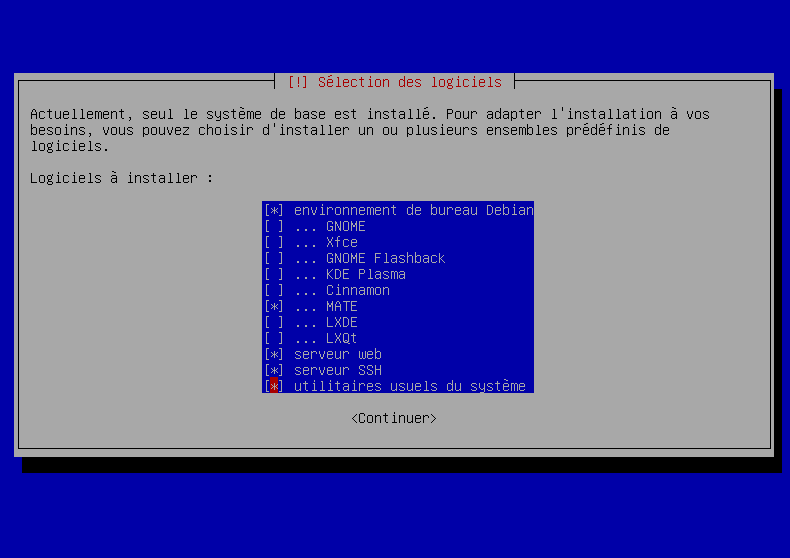{#id .class width=380 length=300}

- Après la fin de l’installation de la VM nous avons dû donner les droits sudo à notres user grâce à l’utilisateur root et à ces commandes : 

```bash
usermod -aG sudo [login]
```

- Ensuite nous avons dû installer les suppléments invités et pour cela nous avons été dans : Périphériques › Insérer l’illustration CD des additions invités…

- Et enfin nous avons utilisé ces commandes : 
   - Monter le CD sudo :  mount /dev/cdrom /mnt
   - Installer les suppléments : sudo /mnt/VBoxLinuxAdditions.run 

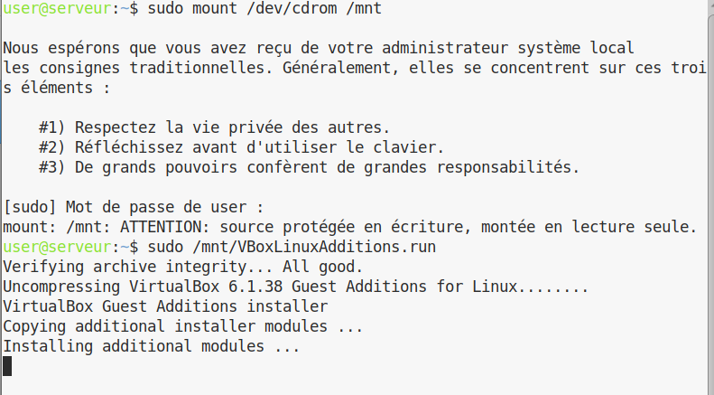{#id .class width=380 length=300}


\newpage
# **Semaine 9**

## **Qu'est-ce que le Projet Debian ? D'où vient le nom Debian ?**

Le **projet Debian** est un projet ayant pour but de créer un système d'exploitation exclusivement constitué de logiciels libres. Il est lancé en 1993 par **Ian Murdock**. Le nom *"Debian"* tire son origine des prénoms du créateur de Debian, *Ian Murdock*, et de son épouse, *Debra*.

{#id .class width=250}

- [Voir la présentation du projet Debian](https://www.debian.org/doc/manuals/project-history/intro.fr.html)
- [Qui est Ian Murdock ?](https://en.wikipedia.org/wiki/Ian_Murdock)

## **Il existe 3 durées de prise en charge (support) de ces versions : la durée minimale, la durée en support long terme (LTS) et la durée en support long terme étendue (ELTS). Quelle sont les durées de ces prises en charge ?**

- **LTS :** 5 ans *(en comptant le minimum)*
  - est un projet pour étendre la durée de vie de toutes les versions stables de Debian à (au moins) 5 ans. Debian LTS n'est pas gérée par l'équipe en charge de la sécurité de Debian, mais par un groupe distinct de bénévoles et sociétés intéressés pour en faire un succès.
- **ELTS :** 10 ans *(5 ans en plus après le LTS)* 
  - est une offre commerciale pour prolonger la durée de vie des versions de Debian à 10 ans
  - **Minimum :** 3 ans 

Ces durées ne sont pas fixes et représentent le maximum.

- [Qu'est-ce que LTS ?](https://wiki.debian.org/fr/LTS)

## **Pendant combien de temps les mises à jour de sécurité seront-elles fournies ?**

Les mises à jours de sécurité sont fournies pour une version si celle-ci est prise en charge.

- [Voir l'explication sur les différentes versions](https://debian-facile.org/viewtopic.php?id=30545)

## **Combien de version au minimum sont activement maintenues par Debian ? Donn+ez leur nom générique (= les types de distribution).**

- Debian 11 : bullseye (version stable)
- Debian 10: buster (version oldstable)
- Debian 9: stretch (version oldoldstable prise en charge LTS)
- Debian 8: jessie (version archivée avec prise en charge ELTS)

- [Voir le guide des versions sur le site officiel de Debian](https://www.debian.org/releases/index.fr.html)
   
## **Chaque distribution majeur possède un nom de code différent. Par exemple, la version majeur actuelle (Debian 11) se nomme Bullseye. D'où viennent les noms de code données aux distributions ?**

- Fait insolite, **Debian** tire ses noms de distributions de personnages des célèbres films [**Toy Story**](https://fr.wikipedia.org/wiki/Toy_Story)

{#id .class height=150}

- [Voir les références de Debian à ToyStory](https://wiki.debian.org/fr/ToyStory) 

## **L'un des atouts de Debian fut le nombre d'architecture officiellement prises en charge. Combien et lesquelles sont prises en charge par la version Bullseye ?**
   
- Si l'on en croit la page d'installation officielle de Debian, les architectures prises en charge sont au total de 9: 
    - **amd64\* :** l'architecture des premiers microprocesseurs 64 bits de la société Advanced Micro Devices
    - **arm64\* :** architecture microélectronique développée par la société ARM. C'est la première architecture ARM 64 bits.
    - **armel** 
    - **armhf** 
    - **i386 :** **Intel 80386**, est un microprocesseur 32 bits CISC fabriqué par Intel utilisé dans de nombreux ordinateurs personnels de 1986 à 1994.
    - **mips :** architecture de processeur de type [Reduced instruction set computer (RISC)](https://fr.wikipedia.org/wiki/Reduced_instruction_set_computer) développée par la société [MIPS Technologies](https://fr.wikipedia.org/wiki/MIPS_Technologies) *(alors appelée MIPS Computer Systems)*.
    - **mipsel**
    - **ppc64el :** ppc64le est un pur mode [little-endian](https://en.wikipedia.org/wiki/Little-endian) qui a été introduit avec le [POWER8](https://en.wikipedia.org/wiki/POWER8) comme cible principale des technologies fournies par la [Fondation OpenPOWER](https://en.wikipedia.org/wiki/OpenPOWER_Foundation) , visant à permettre le portage du logiciel basé sur Linux [x86](https://en.wikipedia.org/wiki/X86) avec un minimum d'effort.
    - **s390x**

*\* Les plus répandus*

Voir également :

- [Voir également la liste des architectures officiellement compatibles](https://www.debian.org/releases/jessie/i386/ch02s01.html.fr)
- [Différences entre ARM64, ARMel et ARMhf](https://linuxhint.com/about-arm64-armel-armhf/)

## **Première version avec un nom de code (date, numéro de version...)**

- La première version [**Debian “Buzz”**](https://wiki.debian.org/fr/DebianBuzz) qui est la version `1.1`, qui est sorti le ***17 juin 1996***, contenait ***474 paquets***.

## **Dernière nom de code attribué (dernier nom à ce jour, date, version...)**

- La dernière version de debian publiée est [**Debian “Bullseye”**](https://wiki.debian.org/fr/DebianBullseye) qui est la version `11` qui est la version **actuelle** et **stable**. Elle a été annoncée le *6 juillet 2016* et publiée le *6 juillet 2019*. Debian est en train de développer une nouvelle version avec comme nom de code [**“Bookworm”**](https://wiki.debian.org/fr/DebianBookworm) mais la date n'a pas encore été dévoilée, cette version est encore en phase de test.

{#id .class height=150}

## **Installation préconfigurée de [Debian 11.6](https://debian.org)**

### **Préparation de la machine virtuelle**

On commence par créer la machine virtuelle sur [VirtualBox](https://virtualbox.org), de la même manière qu'à la semaine précédente.

Création de la machine avec le nom sae203b, de type linux debian 64-bit, dans le fichier /ysr/local/virtual_machine/infoetu/login, 2048 Mo de RAM et 20 GO de disque dur.

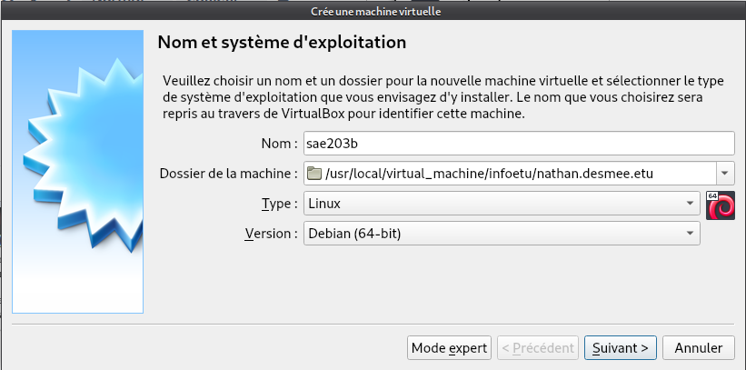{#id .class width=380 length=300}

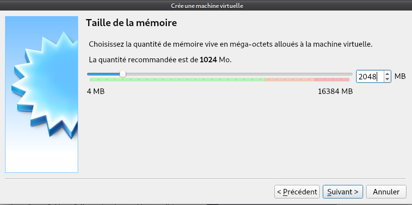{#id .class width=380 length=300}

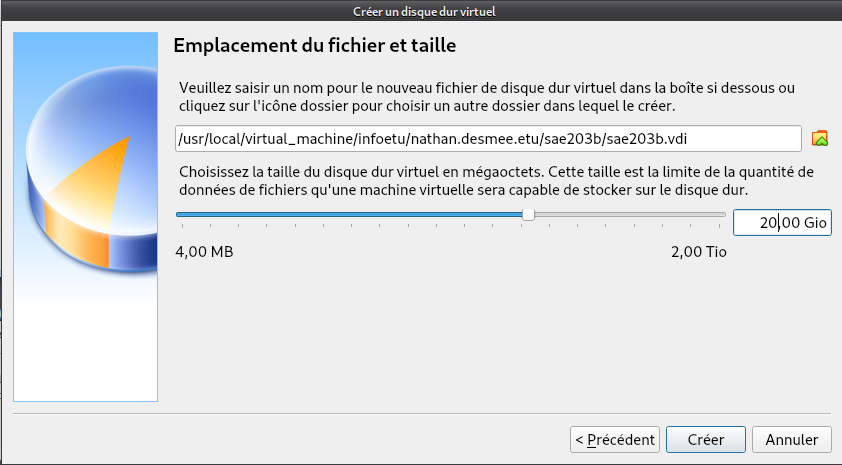{#id .class width=380 length=300}

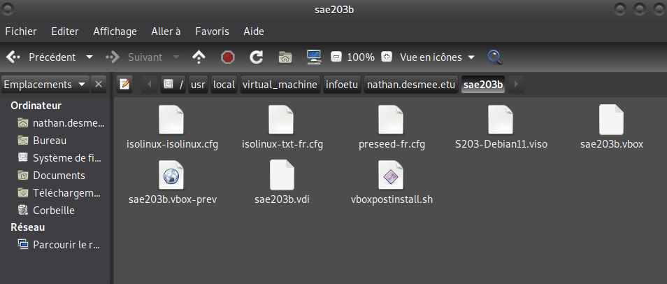{#id .class width=380 length=300}

décompression du fichier autoinstall.zip au même endroit que la VM et faire la commande :

```bash
sed -i -E "s/(--iprt-iso-maker-file-marker-bourne-sh).*$/
\1=$(cat /proc/sys/kernel/random/uuid)/"
```
S203-Debian11.viso au même endroit pour remplacer la chaîne @@UUID@@ par un identifiant unique universel

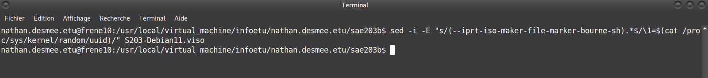{#id .class width=380 length=300}

mise en place du fichier S203_Debian11.viso dans le lecteur optique de la machine virtuelle

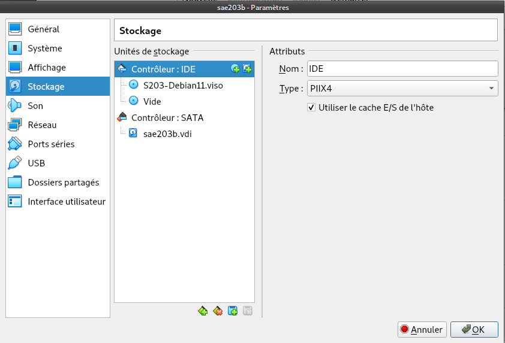{#id .class width=380 length=300}

démarrage de l'auto installation et test des ajouts invités

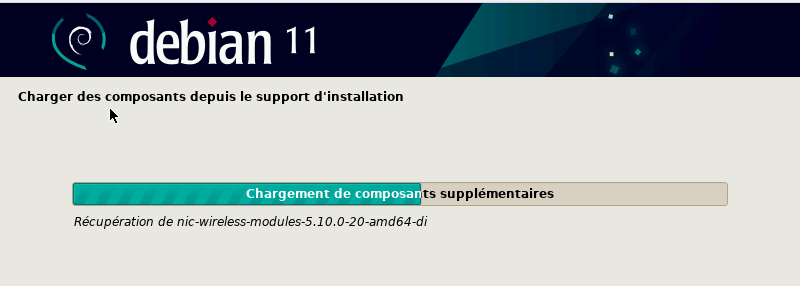{#id .class width=380 length=300}

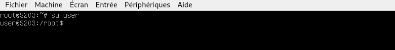{#id .class width=380 length=300}

**Ajout des droits sudo**

Pour mettre les droits sudo à l'user, mettre MATE comme bureau et installer les paquets il faut :

- ajouter sudo aux groupes du user dans la partie Utilisateur Standard : 
`d-i passwd/user-default-groups string audio cdrom video sudo`

- ajouter tous les paquets à installer dans la partie Packages, Mirrors, Image : 
`d-i pkgsel/include string sudo git sqlite3 curl bash-completion neofetch`

- ajouter MATE comme style de bureau de base dans la partie installation de meta-paquetages : 
`tasksel tasksel/first multiselect standard ssh-server mate-desktop desktop `

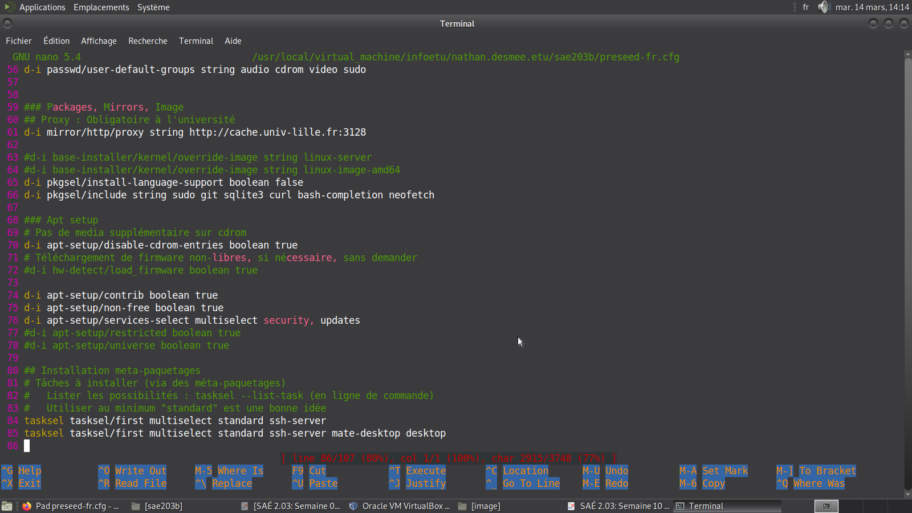{#id .class width=380 length=300}

relancer l'installation et mettre 2 CPU pour que la machine puisse se lancer

**L'installation est désormais terminée et prête à utilisation !**

\newpage
# **Semaine 10 & 11**

## **Qu’est-ce que le logiciel git-gui ? Comment se lance-t-il ?**

`Git-gui` dispose des mêmes fonctionnalités que Git, mais ayant pour avantage de posséder une interface graphique. On peut donc créer un nouveau dépôt Git en local, en indiquant le nom de celui-ci, cela est équivalent à la commande :

```sh
git init [mon_repo]
``` 

Git-gui permet aussi de cloner un dépôt distant en local en indiquant le chemin vers la source et le dossier de destination, ce qui équivaut à : 

```sh
git clone [url_du_dépôt_source] [mon_dossier_local]
```

Il permet d’ouvrir le dépôt en local spécifié avec l’outil Git Gui, lister les derniers dépôts ouverts, menu dans lequel vous retrouverez l’ensemble des actions que nous venons de voir.

Il se lance grâce à ces commandes : 

Pour l'installer :

```sh
sudo apt-get install git-gui
```

Pour le lancer :

```sh
git gui
```

{#id .class width=380 length=300}

## **Qu'est-ce que gitk ?**

[Gitk](https://www.atlassian.com/fr/git/tutorials/gitk#:~:text=gitk%20est%20un%20navigateur%20de,tous%20les%20syst%C3%A8mes%20d'exploitation.) est un navigateur de dépôt graphique, le premier de son genre. Il peut être considéré comme un encapsuleur graphique pour **`git log`**. Il permet d'explorer et de visualiser l'historique d'un dépôt. Il est écrit en [tcl/tk](https://fr.wikipedia.org/wiki/Tool_Command_Language), ce qui le rend portable sur tous les systèmes d'exploitation. gitk est mis à jour par Paul Mackerras en tant que projet indépendant et distinct du noyau Git. Des versions stables sont distribuées dans le cadre de la suite Git pour faciliter la tâche des utilisateurs finaux. Gitk peut être un outil d'apprentissage utile pour les nouveaux venus dans Git.

On le lance avec cette commande : **`gitk`**.

{#id .class width=380 length=300}

## **Quelle sera la ligne de commande git pour utiliser par défaut le proxy de l’université sur tous vos projets git ?**

La ligne de commande permettant de configurer de manière permanente un proxy à Git est la suivante :

```sh
git config --global http.proxy http://notreproxy.fr:notreport
```

## **Qu’est-ce que Gitea ?**

[Gitea](https://gitea.io/en-us/) est une forge logicielle libre, développée en [Golang](https://fr.wikipedia.org/wiki/Go_(langage)) sous [licence MIT](https://fr.wikipedia.org/wiki/Licence_MIT), pour l'hébergement de développement logiciel, basé sur le logiciel de gestion de versions Git pour la gestion du code source, comportant un système de suivi des bugs, un wiki, ainsi que des outils pour la relecture de code. 

Pour information, **Go** est un langage de programmation compilé et concurrent inspiré de **C** et **Pascal**. Ce langage a été développé par Google à partir d’un concept initial de Robert Griesemer, Rob Pike et Ken Thompson.

De plus la licence MIT est une licence de logiciel pour logiciels libres et open source, qui donne à toute personne recevant le logiciel le droit illimité de l'utiliser, le copier, le modifier, le fusionner, le publier, le distribuer, le vendre et de changer sa licence. La seule obligation est de mettre le nom des auteurs avec la notice de copyright.

Comme logiciel similaire à gitea nous pouvons retrouver [GitHub Desktop](https://desktop.github.com/) ou encore [IBM Rational ClearCase](https://www.ibm.com/products/rational-clearcase).

## **Installation de Gitea**

configuration des paramètres git :

```bash
git config --global user.name "Prénom Nom"
git config --global user.email "votre@email"
git config --global init.defaultBranch "master"
```

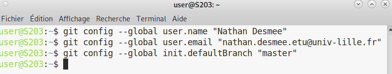{#id .class width=380 length=300}

**installation de git-gui** 

```bash
sudo apt-get install git-gui
```

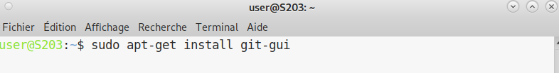{#id .class width=380 length=300}

ensuiteil faut rediriger les messages arrivant sur le port 3000 de la machine physique vers le port 3000 de la machine virtuelle pour cela configurer la machine virtuelle

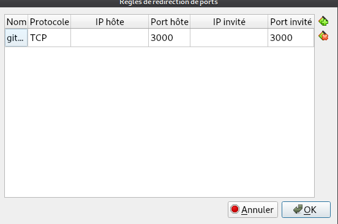{#id .class width=380 length=300}

**installation de gitea 1.18.5**

`wget -O gitea https://dl.gitea.com/gitea/1.18.5/gitea-1.18.5-linux-amd64` : 
installation de gitea dupuis un dépot sur internet
ne pas oublier les lignes :

```bash
export http_proxy=http://cache.univ-lille.fr:3128
export https_proxy=$http_proxy
```

afin d'être connécté à internet

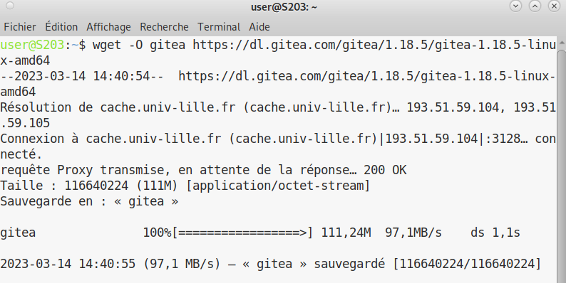{#id .class width=380 length=300}

`chmod +x gitea` pour ajouter les droits d'éxecution sur le dossier gitea

`git --version` pour vérifier si on est bien sur git 2.0 au minimum

```bash
sudo adduser --system --shell /bin/bash --gecos 'Git Version Control' --group 
--disabled-password --home /home/git git pour créer l'utilisateur git pour exécuter gitea
```

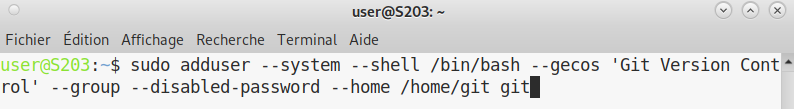{#id .class width=380 length=300}

Pour créer les fichiers nécessaires à gitea avec les droits et propriétaires :

```bash
sudo mkdir -p /var/lib/gitea/{custom,data,log}
sudo chown -R git:git /var/lib/gitea/
sudo chmod -R 750 /var/lib/gitea/
sudo mkdir /etc/gitea
sudo chown root:git /etc/gitea
sudo chmod 770 /etc/gitea
```

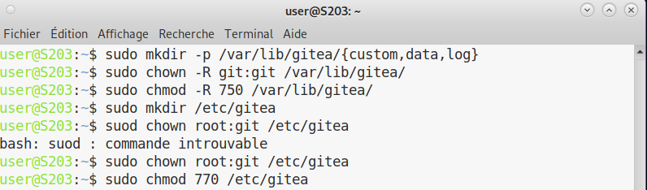{#id .class width=380 length=300}

pour définir une variable d'environnement pour que gitea utilise le bon répertoire de travail :

```bash
export GITEA_WORK_DIR=/var/lib/gitea/ 
```

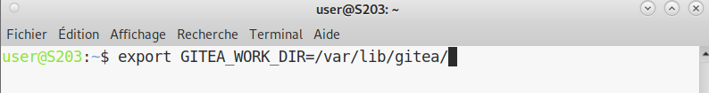{#id .class width=380 length=300}

facultatif avec linux

copie du binaire de gitea au bon endroit : 

```bash
sudo cp gitea /usr/local/bin/gitea
```

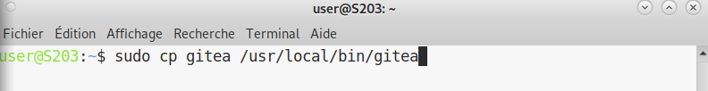{#id .class width=380 length=300}

Lancer gitea automatiquement :

créer un fichier `/etc/systemd/system/gitea.service` et coller le contenu de cette page dedans :
https://github.com/go-gitea/gitea/blob/main/contrib/systemd/gitea.service

pour lancer gitea faire : 

```bash
sudo systemctl enable gitea --now
```

mettre cette URL dans un moteur de recherche (connexion avec gitea qui utilise le port 3000):

http://localhost:3000

paramétrer gitea avec la BDD SQLite3, user gitea password gitea et mail git@localhost

pour finir faire les commandes :

```bash
sudo chmod 750 /etc/gitea
sudo chmod 640 /etc/gitea/app.ini
```

afin de protéger les fichiers `/etc/gitea` et `/etc/gitea/app.ini`

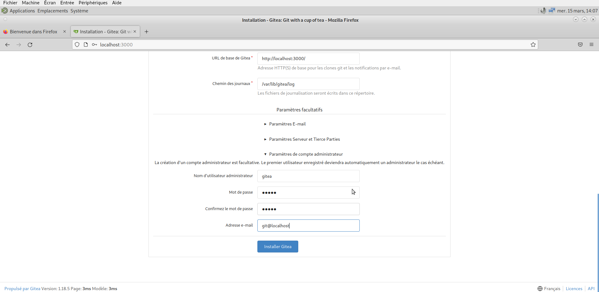{#id .class width=380 length=300}

**Mise à jour**

Pour cela, nous devons arrêter le service gitea, remplacer le binaire gitea de la version actuelle par la nouvelle version, et relancer le service. Pour faire ceci sans reconfigurer soi-même, gitea a mit en place un script bash ([upgrade.sh](https://github.com/go-gitea/gitea/blob/main/contrib/upgrade.sh)) pour automatiser tout cela, on précise uniquement la version souhaité avec l'option ``-v``

```bash
sudo ./upgrade.sh -v 1.19
```

Nous allons maintenant ajouter quelques repos pour tester les fonctionnalités et le bon fonctionnement de Gitea. Depuis l'interface Gitea nous pouvons créer et enrichir directement le repos (comem vous pouvez le voir dans le screen avec le repos example). Mais également depuis la commande git:

Voici un exemple avec le repos 'dev-oo' dédié aux tp de dev poo et qualité dev crée par chaque étudiant dans son propre compte Gitlab

Tout d'abord on crée le repos 'dev-oo' depuis l'interface de Gitea, puis on clone le dépot distant provenant de Gitlab, on change son origine pour lui attribuer celui de Gitea et ainsi commit puis push toutes les fichiers sur le repos 'dev-oo' dans Gitea.

```bash
git clone https://gitlab.univ-lille.fr/[login_etudiant]/dev-oo && cd dev-oo
git remote remove origin
git remote add origin http://localhost:3000/gitea/dev-oo
# La branche sur le repos git est main par défaut 
#contrairement au paramétrage des préliminaires
git branch -m main master
# user: gitea, password: gitea
git push origin master
```

Également, pour les rapports de Saé 2.03, nous initialisons un repos git et on fait un premier commit distant avec tous les rapports:

```bash
git init
git remote add origin http://localhost:3000/gitea/s2.03
git add -A && git commit -m "Initial commit"
git push origin master
```
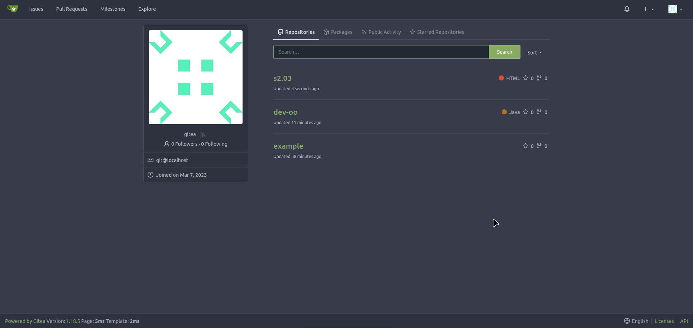{#id .class width=380 length=300}

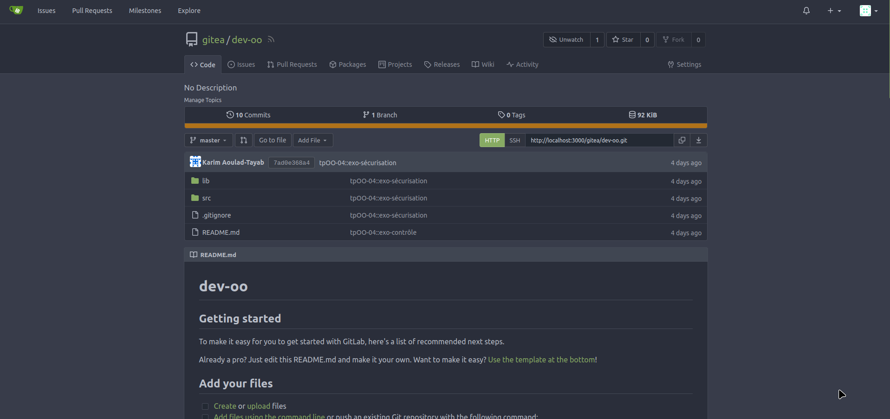{#id .class width=380 length=300}

{#id .class width=380 length=300}


